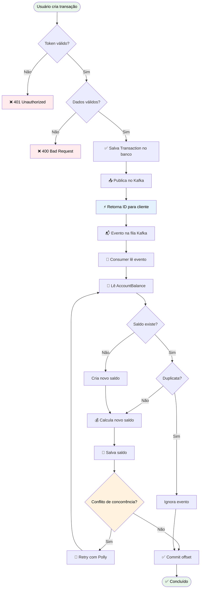

# 💼 Corporate CashFlow

📊 **Sistema de Gestão de Fluxo de Caixa Corporativo**  
Permite que empresas controlem suas finanças (entradas e saídas de dinheiro) de forma **distribuída, escalável e auditável**.

Um sistema moderno para controle financeiro que registra **todas as transações** como eventos (Event Sourcing), garante **auditoria completa** e suporta **alta carga** com processamento assíncrono via Kafka.

---

## 🛠️ Tecnologias Utilizadas

- **.NET 9** – Framework moderno, performático e multiplataforma  
- **Clean Architecture** – Separação clara de responsabilidades
- **Event Sourcing** – Histórico completo de transações
- **CQRS** – Separação entre escrita (commands) e leitura (queries)  
- **Apache Kafka** – Mensageria confiável com **Partition Key** para garantir **ordenação**
- **Idempotent Producer** – Evita duplicações no Kafka  
- **Optimistic Locking (PostgreSQL xmin)** – Controle de concorrência no saldo diário  
- **Entity Framework Core** – ORM para abstração de banco de dados  
- **MediatR** – Organização da lógica com CQRS  
- **FluentValidation** – Validação declarativa e testável  
- **Polly** – Estratégias de resiliência (retry e circuit breaker)  
- **.NET Aspire** – Orquestração de serviços distribuídos  
- **JWT Authentication** – Autenticação segura e escalável  

---

## ⚙️ Pré-requisitos

Antes de rodar o projeto, instale:

- [✅ .NET 9 SDK](https://dotnet.microsoft.com/download)  
- [✅ Docker](https://www.docker.com/) (para Kafka + PostgreSQL)  
- [✅ .NET Aspire](https://learn.microsoft.com/en-us/dotnet/aspire)  

Verifique se tudo está instalado:

```bash
dotnet --version   # deve mostrar 9.x
docker --version   # deve mostrar versão instalada
```

---

## ▶️ Como Executar o Projeto

### 1. Clone o repositório
```bash
git clone https://github.com/sua-org/corporate-cashflow.git
cd corporate-cashflow
```

### 2. Suba os serviços de infraestrutura (Kafka + PostgreSQL)
O Aspire cuida da orquestração automaticamente, mas garanta que o Docker esteja rodando.  

### 3. Execute com Aspire
```bash
dotnet run --project .\src\Corporate.CashFlow.AppHost\Corporate.CashFlow.AppHost.csproj
```

Isso irá:  
- Criar containers de **Kafka**, **PostgreSQL**, **Kafka UI**  
- Subir as APIs (`Identity`, `CashFlow`)  
- Subir os **consumers** para processar eventos  
- Orquestrar tudo no **dashboard Aspire**  

### 4. Acesse o Dashboard
Abra no navegador:  
👉 [https://localhost:17229/](https://localhost:17229)

---

## 🚀 Fluxo de Execução de Uma Transação

1. O usuário envia uma requisição para criar ou consultar transações.  
2. O tráfego passa pelo **Firewall** e **API Gateway** para validação de segurança e roteamento.  
3. As APIs processam a requisição:  
   - **Escrita (Command)**: grava o evento no **Event Store** e publica no Kafka.  
   - **Leitura (Query)**: consulta saldo ou histórico diretamente no banco projetado.  
4. O **Consumer** consome eventos do Kafka, calcula o saldo diário e grava no **Consolidated DB**.  
5. Todas as operações são monitoradas e logadas pelo **.NET Aspire**, garantindo observabilidade completa.  




## 🏗️ System Design

Abaixo uma apresentação do System Design com elementos utilizados e outros que podem fazer parte em um ambiente de produção real. Items que não foram utilizados na solução estão marcados como <span style="color:#aa0000">**(Não utilizado)**</span>

### Componentes Principais

- **Firewall / WAF**: protege contra ataques DDoS e tráfego malicioso <span style="color:#aa0000">**(Não utilizado)**</span>.
- **API Gateway**: centraliza autenticação, autorização e controle de tráfego. <span style="color:#aa0000">**(Não utilizado)**</span>.
- **Identity API**: gerencia autenticação e usuários.
- **CashFlow API**: recebe e grava transações, publica eventos no Kafka.  
- **Kafka**: mensageria confiável para processamento assíncrono e garantia de ordem via **Partition Key**.  
- **Transaction Consumer**: processa eventos do Kafka, consolida saldo diário no banco de dados.  
- **Event Store**: banco de eventos (PostgreSQL) que registra todas as transações.  
- **Consolidated DB**: banco de dados para projeção do saldo diário consolidado, com **Optimistic Locking** para controle de concorrência.  
- **.NET Aspire**: orquestra serviços distribuídos, coleta métricas, logs e traces distribuídos para observabilidade.  


```mermaid
flowchart TD
    User([Usuário]) --> FW[Firewall / WAF] --> APIGW[API Gateway]

    APIGW -->|REST/JSON| IdentityAPI[Identity API]
    APIGW -->|REST/JSON| CashFlowAPI[CashFlow API]

    %% Event Sourcing Write Flow
    CashFlowAPI -->|Grava Evento| EventStore[(PostgreSQL - Event Store)]
    CashFlowAPI -->|Publica Evento| Kafka[(Kafka Broker)]

    %% Consumers
    Kafka -->|Consome Evento| Consumer[Transaction Consumer]
    Consumer -->|Atualiza| ConsolidatedDB[(PostgreSQL - Saldos Consolidados)]

    %% Observabilidade
    subgraph Aspire[.NET Aspire Dashboard]
        Logs[Logs Centralizados]
        Metrics[Métricas]
        Traces[Distributed Traces]
    end

    IdentityAPI --> Aspire
    CashFlowAPI --> Aspire
    Consumer --> Aspire
    Kafka --> Aspire
    EventStore --> Aspire
    ConsolidatedDB --> Aspire
````

## ✅ Próximas Melhorias

- Aumentar cobertura de testes de integração
- Adicionar Testes Unitários 
- Melhorar documentação do Swagger
- Utilizar estratégia de Cache Aside para recuperar dados da conta do usuário

---

## 🎯 Casos de Uso

- **Registrar entrada** (ex: R$ 5.000 de venda)  
- **Registrar saída** (ex: R$ 1.200 de fornecedor)  
- **Consultar histórico** (queries paginadas)  
- **Auditoria completa** (event sourcing garante rastreabilidade)  

---

## ✅ Diferenciais

- **Alta Disponibilidade** – Kafka armazena eventos com segurança  
- **Escalabilidade Horizontal** – múltiplos consumers paralelos  
- **Consistência** – Optimistic Locking e retries com Polly  
- **Performance** – API responde rápido, processamento assíncrono  
- **Auditoria Total** – Event sourcing garante histórico imutável  

---

## 📊 Observabilidade

O **.NET Aspire** fornece:

- Logs centralizados  
- Traces distribuídos  
- Métricas (CPU, memória, requests/segundo)  
- Health checks dos serviços  
- Dashboard acessível em `https://localhost:17229/`  

---

## 🎓 Conceitos Avançados Usados

- Event Sourcing  
- CQRS  
- DDD (Domain-Driven Design)  
- Clean Architecture  
- Microservices  
- Async Processing (Kafka)  
- Optimistic Concurrency (PostgreSQL `xmin`)  
- Retry Patterns (Polly)  
- Idempotent Producer  
- JWT Authentication  

---

## 🎯 Resumo Executivo

O **Corporate CashFlow** é um sistema que:  

- **Gerencia fluxo de caixa** de empresas  
- **Garante consistência e auditabilidade**  
- **Escala horizontalmente** com Kafka  
- **Mantém segurança** com JWT

---

