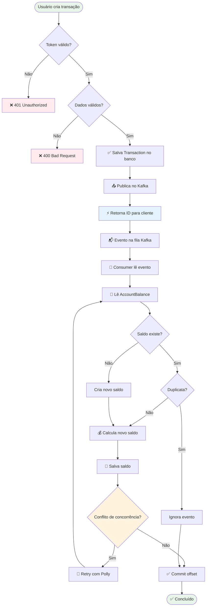

# 💼 Corporate CashFlow

📊 **Sistema de Gestão de Fluxo de Caixa Corporativo**  
Permite que empresas controlem suas finanças (entradas e saídas de dinheiro) de forma **distribuída, escalável e auditável**.

---

## 🎯 O Que É Este Projeto?
Um sistema moderno para controle financeiro que registra **todas as transações** como eventos (Event Sourcing), garante **auditoria completa** e suporta **alta carga** com processamento assíncrono via Kafka.

---

## 🛠️ Tecnologias Utilizadas

- **.NET 9** – Framework moderno, performático e multiplataforma  
- **Clean Architecture** – Separação clara de responsabilidades  
- **Event Sourcing** – Histórico completo de transações  
- **CQRS** – Separação entre escrita (commands) e leitura (queries)  
- **Apache Kafka** – Mensageria confiável com **Partition Key** para garantir ordenação  
- **Idempotent Producer** – Evita duplicações no Kafka  
- **Optimistic Locking (PostgreSQL xmin)** – Controle de concorrência no saldo diário  
- **Entity Framework Core** – ORM para abstração de banco de dados  
- **MediatR** – Organização da lógica com CQRS  
- **FluentValidation** – Validação declarativa e testável  
- **Polly** – Estratégias de resiliência (retry e circuit breaker)  
- **.NET Aspire** – Orquestração de serviços distribuídos  
- **JWT Authentication** – Autenticação segura e escalável  

---

## ⚙️ Pré-requisitos

Antes de rodar o projeto, instale:

- [✅ .NET 9 SDK](https://dotnet.microsoft.com/download)  
- [✅ Docker](https://www.docker.com/) (para Kafka + PostgreSQL)  
- [✅ .NET Aspire](https://learn.microsoft.com/en-us/dotnet/aspire)  

Verifique se tudo está instalado:

```bash
dotnet --version   # deve mostrar 9.x
docker --version   # deve mostrar versão instalada
```

---

## ▶️ Como Executar o Projeto

### 1. Clone o repositório
```bash
git clone https://github.com/sua-org/corporate-cashflow.git
cd corporate-cashflow
```

### 2. Suba os serviços de infraestrutura (Kafka + PostgreSQL)
O Aspire cuida da orquestração automaticamente, mas garanta que o Docker esteja rodando.  

### 3. Execute com Aspire
```bash
dotnet run --project CorporateCashFlow.AppHost
```

Isso irá:  
- Criar containers de **Kafka**, **PostgreSQL**, **Kafka UI**  
- Subir as APIs (`Identity`, `CashFlow`)  
- Subir os **consumers** para processar eventos  
- Orquestrar tudo no **dashboard Aspire**  

### 4. Acesse o Dashboard
Abra no navegador:  
👉 [http://localhost:15000](http://localhost:15000)

---

## 🚀 Fluxo de Execução de Uma Transação



## 🏗️ System Design

```mermaid
architecture-beta
    group internet(cloud)[Internet]
        service user(user)[Usuário]

    group security(cloud)[Segurança]
        service fw(shield)[Firewall / WAF]
        service apigw(gateway)[API Gateway]

    group app(cloud)[Aplicações]
        service identityapi(api)[Identity API (.NET 9)]
        service cashflowapi(api)[CashFlow API (.NET 9)]
        service consumer(queue)[Transaction Consumer]

    group messaging(cloud)[Mensageria]
        service kafka(message-queue)[Apache Kafka]

    group db(cloud)[Banco de Dados]
        service eventstore(database)[PostgreSQL - Event Store]
        service consolidateddb(database)[PostgreSQL - Saldos Consolidados]

    group observability(cloud)[Observabilidade]
        service aspire(monitor)[.NET Aspire Dashboard]
        service logs(logs)[Logs]
        service metrics(metrics)[Métricas]
        service traces(traces)[Traces Distribuídos]

    %% Conexões
    user:R -- L:fw
    fw:R -- L:apigw

    apigw:B -- T:identityapi
    apigw:B -- T:cashflowapi

    cashflowapi:B -- T:eventstore
    cashflowapi:R -- L:kafka

    kafka:R -- L:consumer
    consumer:B -- T:consolidateddb

    %% Observabilidade
    identityapi:B -- T:aspire
    cashflowapi:B -- T:aspire
    consumer:B -- T:aspire
    kafka:B -- T:aspire
    eventstore:B -- T:aspire
    consolidateddb:B -- T:aspire

    aspire:B -- T:logs
    aspire:B -- T:metrics
    aspire:B -- T:traces

````

---

## 🎯 Casos de Uso

- **Registrar entrada** (ex: R$ 5.000 de venda)  
- **Registrar saída** (ex: R$ 1.200 de fornecedor)  
- **Consultar histórico** (queries paginadas)  
- **Auditoria completa** (event sourcing garante rastreabilidade)  

---

## ✅ Diferenciais

- **Alta Disponibilidade** – Kafka armazena eventos com segurança  
- **Escalabilidade Horizontal** – múltiplos consumers paralelos  
- **Consistência** – Optimistic Locking e retries com Polly  
- **Performance** – API responde rápido, processamento assíncrono  
- **Auditoria Total** – Event sourcing garante histórico imutável  

---

## 📊 Observabilidade

O **.NET Aspire** fornece:

- Logs centralizados  
- Traces distribuídos  
- Métricas (CPU, memória, requests/segundo)  
- Health checks dos serviços  
- Dashboard acessível em `http://localhost:15000`  

---

## 🎓 Conceitos Avançados Usados

- Event Sourcing  
- CQRS  
- DDD (Domain-Driven Design)  
- Clean Architecture  
- Microservices  
- Async Processing (Kafka)  
- Optimistic Concurrency (PostgreSQL `xmin`)  
- Retry Patterns (Polly)  
- Idempotent Producer  
- JWT Authentication  

---

## 🎯 Resumo Executivo

O **Corporate CashFlow** é um sistema que:  

- **Gerencia fluxo de caixa** de empresas  
- **Garante consistência e auditabilidade**  
- **Escala horizontalmente** com Kafka  
- **Mantém segurança** com JWT + bcrypt  

👥 Público-alvo: empresas que buscam **controle financeiro robusto, alta disponibilidade e compliance**.  

