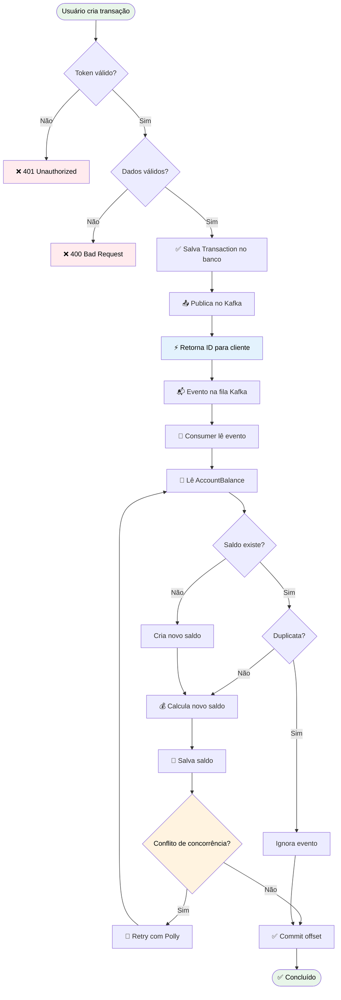

# 💼 Corporate CashFlow

📊 **Sistema de Gestão de Fluxo de Caixa Corporativo**  
Permite que empresas controlem suas finanças (entradas e saídas de dinheiro) de forma **distribuída, escalável e auditável**.

Um sistema moderno para controle financeiro que registra **todas as transações** como eventos (Event Sourcing), garante **auditoria completa** e suporta **alta carga** com processamento assíncrono via Kafka.

---

## 🛠️ Funcionalidades e Conceitos Técnicos Utilizadas

- **.NET 9** – Framework
- **Clean Architecture** – Design do Código
- **Event Sourcing** – Auditoria
- **CQRS** – Separação entre escrita (commands) e leitura (queries) (Implementada no código em um único Banco de Dados para simplificação)

---
  
- **Apache Kafka** – Mensageria confiável com **Partition Key** para garantir **ordenação**
- **Idempotent Producer** - Garante que as mensagens sejam entregas a todas as partições e **Exacly Once** com lógica de tratamento de duplicidade de consolidação no downstream mesmo que haja retry na entrega.
- **Optimistic Locking (PostgreSQL xmin)** - Garante a resiliência na consolidação e realiza o retry com a versão correta do saldo.<br/><br/>
Para que as transações sejam processadas em **ordem** e com **idempotência**, garantindo que as consolidações de saldo sejam confiáveis 
---
- **Entity Framework Core** – ORM para abstração de banco de dados  
- **MediatR** – Organização da lógica com CQRS  
- **FluentValidation** – Validação declarativa e testável  
- **Polly** – Estratégias de resiliência (retry e circuit breaker)  
- **.NET Aspire** – Orquestração de serviços distribuídos  
- **JWT Authentication** – Autenticação segura e escalável  

---

## ⚙️ Pré-requisitos

Antes de rodar o projeto, instale:

- [✅ .NET 9 SDK](https://dotnet.microsoft.com/download)  
- [✅ Docker](https://www.docker.com/) (para Kafka + PostgreSQL)  
- [✅ .NET Aspire workload](https://learn.microsoft.com/en-us/dotnet/aspire)  

Verifique se tudo está instalado:

```bash
dotnet --version   # deve mostrar 9.x
dotnet workload install aspire
docker
```

---

## ▶️ Como Executar o Projeto

### 1. Clone o repositório
```bash
git clone https://github.com/bdiogoandre/corporate-cashflow.git
cd corporate-cashflow
```

### 2. Suba os serviços de infraestrutura (Kafka + PostgreSQL)
O Aspire cuida da orquestração automaticamente, mas garanta que o Docker esteja rodando.  

### 3. Execute com Aspire
```bash
dotnet run --project .\src\Corporate.CashFlow.AppHost\Corporate.CashFlow.AppHost.csproj
```

Isso irá:  
- Criar containers de **Kafka**, **PostgreSQL**, **Kafka UI**  
- Subir as APIs (`Identity`, `CashFlow`)  
- Subir os **consumers** para processar eventos  
- Orquestrar tudo no **dashboard Aspire**  

### 4. Acesse o Dashboard
Abra no navegador:  
👉 [https://localhost:17229/](https://localhost:17229)

---

## 🚀 Fluxo de Execução de Uma Transação

* Items que não foram utilizados na solução estão marcados como <span style="color:#aa0000">**(Não utilizado)**</span>

1. O usuário envia uma requisição para criar ou consultar transações.  
2. As APIs processam a requisição:  
   - **Escrita (Command)**: grava o evento no **Event Store** e publica no Kafka.  
   - **Leitura (Query)**: consulta saldo ou histórico diretamente no banco projetado.  
3. O **Consumer** consome eventos do Kafka, calcula o saldo diário e grava no **Consolidated DB**.  
4. Todas as operações são monitoradas e logadas pelo **.NET Aspire**, garantindo observabilidade completa.  



```mermaid
graph TD;
    Start([Usuário cria transação]) --> Auth{Token válido?}
    Auth -->|Não| Reject[❌ 401 Unauthorized]
    Auth -->|Sim| Validate{Dados válidos?}
    
    Validate -->|Não| Error[❌ 400 Bad Request]
    Validate -->|Sim| SaveEvent[✅ Salva Transaction no banco]
    
    SaveEvent --> Publish[📤 Publica no Kafka]
    Publish --> Return[⚡ Retorna ID para cliente]
    
    Return --> Queue[📬 Evento na fila Kafka]
    Queue --> Consume[🔄 Consumer lê evento]
    
    Consume --> ReadBalance[📖 Lê AccountBalance]
    ReadBalance --> Exists{Saldo existe?}
    
    Exists -->|Não| Create[Cria novo saldo]
    Exists -->|Sim| CheckDup{Duplicata?}
    
    CheckDup -->|Sim| Skip[Ignora evento]
    CheckDup -->|Não| Calculate[💰 Calcula novo saldo]
    Create --> Calculate
    
    Calculate --> SaveBalance[💾 Salva saldo]
    SaveBalance --> Conflict{Conflito de concorrência?}
    
    Conflict -->|Sim| Retry[🔁 Retry com Polly]
    Conflict -->|Não| Commit[✅ Commit offset]
    
    Retry --> ReadBalance
    Commit --> Done([✅ Concluído])
    Skip --> Commit

    style Start fill:#e8f5e9,color:#000
    style Done fill:#e8f5e9,color:#000
    style Reject fill:#ffebee,color:#000
    style Error fill:#ffebee,color:#000
    style Conflict fill:#fff3e0,color:#000
    style Return fill:#e3f2fd,color:#000
```

## 🏗️ System Design

**Ambiente:** Cluster Kubernetes para orquestrar os containers e garantir a escalabilidade horizontal.
Abaixo uma apresentação do System Design com elementos utilizados e outros que podem fazer parte em um ambiente de produção real. Items que não foram utilizados na solução estão marcados como <span style="color:#aa0000">**(Não utilizado)**</span>

### Componentes Principais

- **Firewall / WAF**: protege contra ataques DDoS e tráfego malicioso <span style="color:#aa0000">**(Não utilizado)**</span>.
- **API Gateway**: centraliza autenticação, autorização e controle de tráfego. <span style="color:#aa0000">**(Não utilizado)**</span>.
- **Load Balancer**: Para balancear a carga de requisições <span style="color:#aa0000">**(Não utilizado)**</span>.
- **Identity API**
- **CashFlow API**: recebe e grava transações, publica eventos no Kafka.  
- **Transaction Consumer**: processa eventos do Kafka, consolida saldo diário no banco de dados.  
- **Event Store**
- **Consolidated DB**
- **.NET Aspire**: orquestra serviços distribuídos, coleta métricas, logs e traces distribuídos para observabilidade. No desenho representado pela stack Loki, Tempo e Prometheus com Grafana.

```mermaid
flowchart TD
    %% Nodes (cada nó declarado em sua própria linha)
    User[Usuário]
    FW[Firewall / WAF]
    APIGW[API Gateway]

    ALBIdentity[ALB - Identity API]
    IdentityAPI[Identity API]

    ALBCashFlow[ALB - CashFlow API]
    CashFlowAPI[CashFlow API - Write]

    ALBBalance[ALB - Balance API]
    BalanceAPI[Balance API - Read]

    EventStore[PostgreSQL - Event Store]
    Kafka[Kafka Broker]
    Consumer[Transaction Consumer]
    ConsolidatedDB[PostgreSQL - Saldos Consolidados]

    Aspire[Grafana - Loki; Prometheus; Tempo]

    %% Links (cada conexão em sua própria linha)
    User --> FW
    FW --> APIGW

    APIGW -->|REST/JSON| ALBIdentity
    ALBIdentity --> IdentityAPI

    APIGW -->|REST/JSON| ALBCashFlow
    ALBCashFlow --> CashFlowAPI

    APIGW -->|REST/JSON| ALBBalance
    ALBBalance --> BalanceAPI

    CashFlowAPI -->|Grava Evento| EventStore
    CashFlowAPI -->|Publica Evento| Kafka

    Kafka -->|Consome Evento| Consumer
    Consumer -->|Atualiza| ConsolidatedDB

    BalanceAPI -->|Consulta| ConsolidatedDB

    %% Observability
    IdentityAPI --> Aspire
    CashFlowAPI --> Aspire
    BalanceAPI --> Aspire
    Consumer --> Aspire
    Kafka --> Aspire
    EventStore --> Aspire
    ConsolidatedDB --> Aspire

````

## ✅ Próximas Melhorias

- Aumentar cobertura de testes de integração
- Adicionar Testes Unitários 
- Melhorar documentação do Swagger
- Utilizar estratégia de Cache Aside para recuperar dados da conta do usuário

---

## 🎯 Casos de Uso

- **Registrar entrada** (ex: R$ 5.000 de venda)  
- **Registrar saída** (ex: R$ 1.200 de fornecedor)  
- **Consultar histórico** (queries paginadas)  
- **Auditoria completa** (event sourcing garante rastreabilidade)  

---

## ✅ Diferenciais

- **Alta Disponibilidade** – Kafka armazena eventos com segurança  
- **Escalabilidade Horizontal** – múltiplos consumers paralelos  
- **Consistência** – Optimistic Locking e retries com Polly  
- **Performance** – API responde rápido, processamento assíncrono  
- **Auditoria Total** – Event sourcing garante histórico imutável  

---

## 📊 Observabilidade

O **.NET Aspire** fornece:

- Logs centralizados  
- Traces distribuídos  
- Métricas (CPU, memória, requests/segundo)  
- Health checks dos serviços  
- Dashboard acessível em `https://localhost:17229/`  

---

## 🎓 Conceitos Avançados Usados

- Event Sourcing  
- CQRS  
- DDD (Domain-Driven Design)  
- Clean Architecture  
- Microservices  
- Async Processing (Kafka)  
- Optimistic Concurrency (PostgreSQL `xmin`)  
- Retry Patterns (Polly)  
- Idempotent Producer  
- JWT Authentication  

---

## 🎯 Resumo Executivo

O **Corporate CashFlow** é um sistema que:  

- **Gerencia fluxo de caixa** de empresas  
- **Garante consistência e auditabilidade**  
- **Escala horizontalmente** com Kafka  
- **Mantém segurança** com JWT

---

## Coleta de Métricas
flowchart TD
    subgraph User["Usuário / Grafana"]
        GQuery["Consulta (PromQL)"]
    end

    subgraph Global["Escala Global (HA / Multi-Cluster)"]
        subgraph Thanos["Thanos / Cortex / Mimir"]
            Querier["Thanos Querier (API PromQL)"]
            StoreGW["Store Gateway"]
            Compactor["Compactor"]
            Bucket["Object Storage (S3, GCS, Azure Blob)"]
        end
    end

    subgraph Cluster1["Kubernetes Cluster A"]
        subgraph PromA["Prometheus A (HA)"]
            TSA["TSDB (local)"]
            SidecarA["Thanos Sidecar"]
        end

        subgraph AppsA["Aplicações .NET (Pods)"]
            A1["Pod 1 /metrics"]
            A2["Pod 2 /metrics"]
        end

        subgraph InfraA["Infraestrutura"]
            KubeStateA["kube-state-metrics"]
            CadvisorA["Kubelet / cAdvisor"]
            NodeExpA["Node Exporter"]
        end
    end

    subgraph Cluster2["Kubernetes Cluster B"]
        subgraph PromB["Prometheus B (HA)"]
            TSB["TSDB (local)"]
            SidecarB["Thanos Sidecar"]
        end

        subgraph AppsB["Aplicações .NET (Pods)"]
            B1["Pod 1 /metrics"]
            B2["Pod 2 /metrics"]
        end

        subgraph InfraB["Infraestrutura"]
            KubeStateB["kube-state-metrics"]
            CadvisorB["Kubelet / cAdvisor"]
            NodeExpB["Node Exporter"]
        end
    end

    %% Scraping Flow
    PromA -->|Scraping| A1
    PromA -->|Scraping| A2
    PromA -->|Scraping| KubeStateA
    PromA -->|Scraping| CadvisorA
    PromA -->|Scraping| NodeExpA

    PromB -->|Scraping| B1
    PromB -->|Scraping| B2
    PromB -->|Scraping| KubeStateB
    PromB -->|Scraping| CadvisorB
    PromB -->|Scraping| NodeExpB

    %% Sidecar Upload
    SidecarA --> StoreGW
    SidecarB --> StoreGW

    %% Object Storage
    StoreGW --> Bucket
    Compactor --> Bucket
    Querier --> StoreGW
    Querier --> Bucket

    %% Queries
    GQuery --> Querier


```

